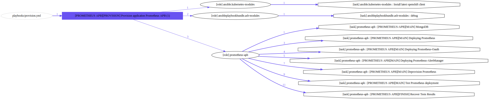
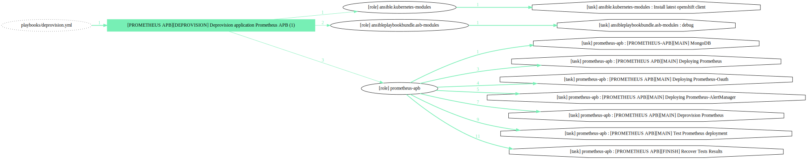
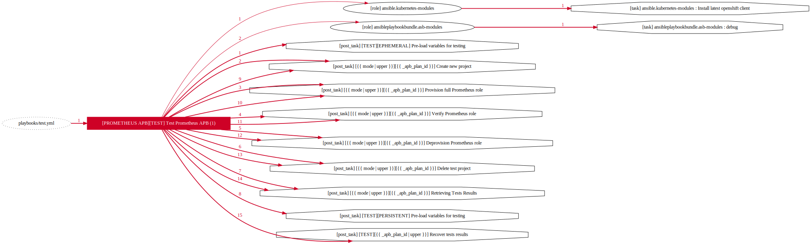

# APB Execution modes

## Provision

This mode will provision the APB app into Openshift, you must be logged as not system:admin to do that, and just consume it from Ansible Service Broker catalog.

See the [needed parameters](./apb_parameters.yml) to know and ensure that all the required ones are fulfilled.

On this execution mode you have 3 plans:

- **ephemeral**
This plan will create a pod with an instance of MongoDB running on standalone mode and non-persistent storage

- **persistent**
This plan will create a pod with an instance of MongoDB running on standalone mode and a persistent storage, take care with a non-provided PVs whe you execute this mode, as a requirement will need at least a PV with 1 Gi (default) to work fine

This is the graph of a Provision execution:

## Deprovision

The Deprovision will just erase the deployment from your project, it will take care about the DeploymentConfig.

This is the execution flow of Deprovision execution

## Test

This execution mode will perform this actions on your Openshift installation:

- Load variables for ephemeral scenario 
- Create a project with a specific name
- Provision prometheus-apb role with **Ephemeral Plan**
- Deprovision prometheus-apb role with **Ephemeral Plan**
- Delete the project with a specific name

- Load variables for persistent scenario 
- Create a project with a specific name
- Provision prometheus-apb role with **Persistent Plan**
- Deprovision prometheus-apb role with **Persistent Plan**
- Delete the project with a specific name

This mode only could be executed from command line and are oriented to APB Development and Support

This is the execution flow of Test mode

